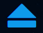

<div align="center">
  
  
# [BoostMat UI](https://boostmat-ui.netlify.app)
  Boost your web development by using CSS Component Library 
</div>

## Technology Used -
  * HTML
  * Vanilla CSS
  * JavaScript
  
## Installation -
To get the styles of the components, add the following line of code in the head tag of your HTML document.
```html
<link rel="stylesheet" href="https://boostmat-ui.netlify.app/components/component.css">

<link rel="stylesheet" href="https://cdnjs.cloudflare.com/ajax/libs/font-awesome/4.7.0/css/font-awesome.min.css">
```

## Components Defined in BoostMat  -

  * [Alert](https://boostmat-ui.netlify.app/components/alert/alert.html)
  * [Avatar](https://boostmat-ui.netlify.app/components/alert/alert.html)
  * [Badge](https://boostmat-ui.netlify.app/components/badge/badge.html)
  * [Button](https://boostmat-ui.netlify.app/components/button/button.html)
  * [Card](https://boostmat-ui.netlify.app/components/card/card.html)
  * [Image](https://boostmat-ui.netlify.app/components/image/image.html)
  * [Input](https://boostmat-ui.netlify.app/components/input/input.html)
  * [Lists](https://boostmat-ui.netlify.app/components/lists/lists.html)
  * [Modal](https://boostmat-ui.netlify.app/components/modal/modal.html)
  * [Navigation](https://boostmat-ui.netlify.app/components/navigation/navigation.html)
  * [Rating](https://boostmat-ui.netlify.app/components/rating/rating.html)
  * [Responsive Grid](https://boostmat-ui.netlify.app/components/grid/grid.html)
  * [Slider](https://boostmat-ui.netlify.app/components/slider/slider.html)
  * [Text Utility](https://boostmat-ui.netlify.app/components/text-utilities/textUtilities.html)
  * [Toast](https://boostmat-ui.netlify.app/components/toast/toast.html)
 
## Demo


